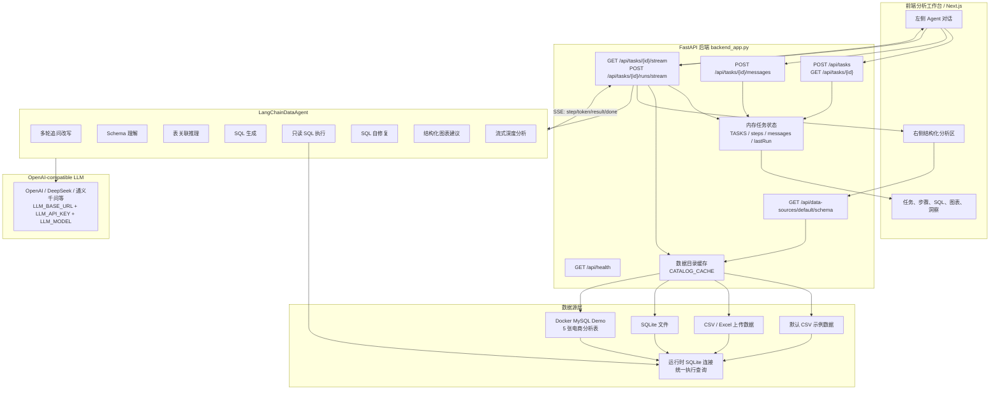
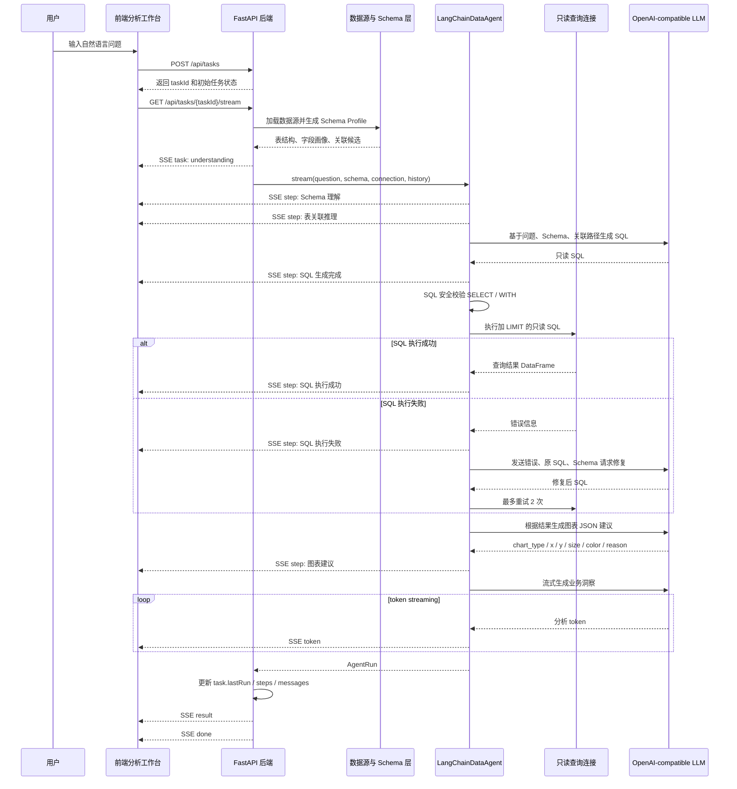
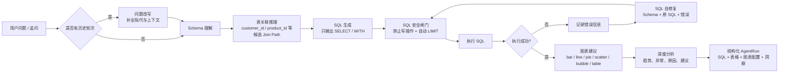
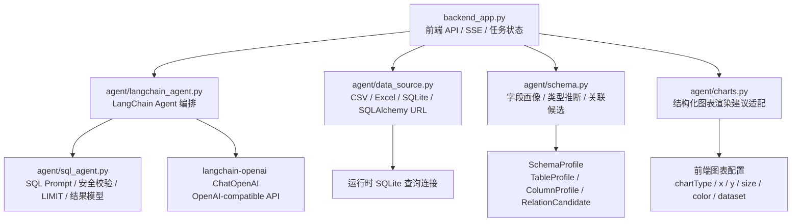
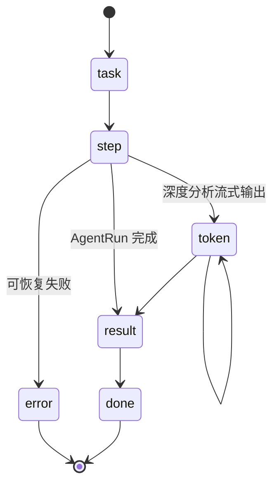

# 数据分析 Agent 后端架构图

这份图面向比赛答辩和前后端联调，突出后端如何把前端任务、Schema 理解、表关联推理、SQL 生成、自修复、图表建议和深度分析串成完整 Agent 链路。

## 0. 展示版 SVG 架构图

已按 `fireworks-tech-graph` 的扁平技术图风格生成展示版 SVG：

- [agent-backend-architecture-fireworks.svg](../assets/agent-backend-architecture-fireworks.svg)

## 1. 后端总体架构

## 2. 一次问数请求时序

## 3. Agent 内部执行流水线

## 4. 后端模块职责

## 5. 推荐给前端的 SSE 事件

事件含义：

- `task`：任务元信息和当前状态。
- `step`：Schema 理解、关联推理、SQL 生成、SQL 执行、自修复、图表建议、深度分析等步骤状态。
- `token`：深度分析阶段的流式文本片段。
- `result`：最终结构化结果，包括 SQL、表格预览、图表配置和业务洞察。
- `error`：可恢复错误，前端可展示重试或修改问题入口。
- `done`：本轮任务结束。

## 6. 当前 Demo 的技术边界

- 任务状态当前保存在内存中，适合本地 demo；如果要上线，需要换成数据库表。
- SQL 执行统一走只读校验，并自动加行数限制。
- 多轮上下文当前使用上一轮 `question/sql/analysis` 作为追问补全依据。
- 数据源可以来自默认 CSV、上传文件、SQLite 或 SQLAlchemy URL；MySQL demo 通过 SQLAlchemy URL 接入。
- 后端不会暴露模型推理链路，只向前端输出可展示证据、SQL、结果和洞察。
